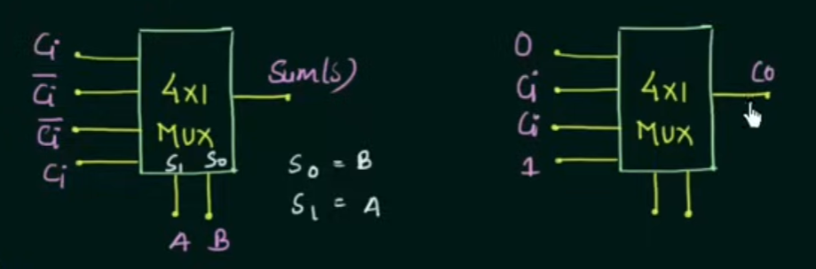
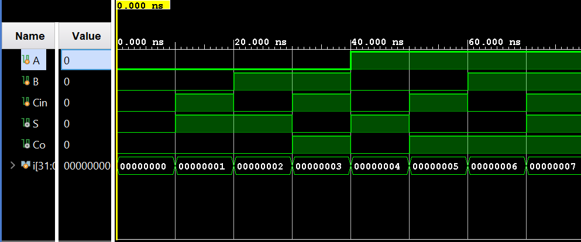

## 1-Bit Full Adder Using 4x1 Multiplexers | Verilog

A **Verilog implementation of a 1-bit full adder using 4x1 multiplexer (MUX) blocks**, designed and simulated in **Xilinx Vivado**.  
This document explains:

- **What a full adder is**
- **How a 4×1 MUX works**
- **How to build a 1-bit full adder using two 4×1 MUXes running in parallel**
- The **truth table**, **K‑maps**, **input assignments**, and **simulation results**

The project includes the **RTL design**, **testbench**, **simulation waveform**, and **console-style output** verifying correct behavior.

---

## Table of Contents

- [What Is a Full Adder?](#what-is-a-full-adder)
- [4x1 Multiplexer Basics](#4x1-multiplexer-basics)
- [1-Bit Full Adder Truth Table](#1-bit-full-adder-truth-table)
- [K‑Map Derivation and MUX Input Mapping](#k-map-derivation-and-mux-input-mapping)
  - [Sum Output \(S\) Using a 4×1 MUX](#sum-output-s-using-a-4×1-mux)
  - [Carry Output \(C\_o\) Using a 4×1 MUX](#carry-output-co-using-a-4×1-mux)
- [Implementing the Full Adder Using Two 4×1 MUXes](#implementing-the-full-adder-using-two-4×1-muxes)
- [Circuit Diagram](#circuit-diagram)
- [Waveform Diagram](#waveform-diagram)
- [Testbench Output](#testbench-output)
- [Running the Project in Vivado](#running-the-project-in-vivado)
- [Project Files](#project-files)

---

## What Is a Full Adder?

A **1-bit full adder** is a combinational logic circuit that adds **three 1-bit binary inputs**:

- **A** – first operand bit  
- **B** – second operand bit  
- **Ci** – input carry (carry-in)

It produces **two outputs**:

- **S** – sum bit  
- **Co** – carry-out bit

Conceptually, it performs:

The operation can be written as:

```text
A + B + Ci = Co S
```

where `S` is the least significant bit of the sum and `Co` is the carry to the next higher bit.

---

A **4x1 multiplexer** has:

- **Inputs**: `I0, I1, I2, I3`  
- **Select lines**: `S1, S0`  
- **Output**: `Y`

The select lines form a **2-bit binary number** that chooses exactly **one input** to be routed to the output:

| S1 | S0 | Selected Input | Output     |
|----|----|----------------|------------|
| 0  | 0  | `I0`           | `Y = I0`   |
| 0  | 1  | `I1`           | `Y = I1`   |
| 1  | 0  | `I2`           | `Y = I2`   |
| 1  | 1  | `I3`           | `Y = I3`   |

In this project, we use:

- **Two 4x1 MUXes in parallel**
  - One MUX generates the **sum `S`**
  - One MUX generates the **carry `Co`**
- The **same select lines** for both:
  - **S0 = B**
  - **S1 = A**
- The third input **Ci** is used inside each MUX as part of the data inputs `I0...I3`.

---

## 1-Bit Full Adder Truth Table

The complete truth table for the 1‑bit full adder is:

| A | B | Ci | S | Co |
|---|---|------|---|------|
| 0 | 0 | 0    | 0 | 0    |
| 0 | 0 | 1    | 1 | 0    |
| 0 | 1 | 0    | 1 | 0    |
| 0 | 1 | 1    | 0 | 1    |
| 1 | 0 | 0    | 1 | 0    |
| 1 | 0 | 1    | 0 | 1    |
| 1 | 1 | 0    | 0 | 1    |
| 1 | 1 | 1    | 1 | 1    |

From this table, the well-known Boolean expressions are:

```text
S  = A ⊕ B ⊕ Ci
Co = A·B + B·Ci + A·Ci
```

In this implementation, we do **not** realize these expressions directly with gates; instead, we **realize both outputs using 4×1 multiplexers**.

---

## K‑Map Derivation and MUX Input Mapping

To implement a function with a 4x1 MUX:

- Choose **two variables as select lines**.
- Use the **third variable** within the input assignments \(I_0\ldots I_3\).

Here we choose:

- **Selector mapping**:
  - **S1 = A**
  - **S0 = B**
- **Remaining variable**:
  - **Ci** is used inside the input functions.

So each MUX will have a truth table of the form:

| S1 (A) | S0 (B) | Selected Input | Output          |
|--------|--------|----------------|-----------------|
| 0      | 0      | `I0`           | `f(A=0,B=0,Ci)` |
| 0      | 1      | `I1`           | `f(A=0,B=1,Ci)` |
| 1      | 0      | `I2`           | `f(A=1,B=0,Ci)` |
| 1      | 1      | `I3`           | `f(A=1,B=1,Ci)` |

We now derive \(I_0\ldots I_3\) for **S** and **C\_o** separately using K‑maps.

### Sum Output `S` Using a 4x1 MUX

K-map for **sum S** with **rows = A**, **columns = (B, Ci)**:

| A \\ B,Ci | 00 | 01 | 11 | 10 |
|------------|----|----|----|----|
| 0          | 0  | 1  | 0  | 1  |
| 1          | 1  | 0  | 1  | 0  |

Grouping by `(A,B)` and examining dependence on `Ci`, we obtain the MUX input assignments:

| S1 (A) | S0 (B) | S           | MUX Input Definition |
|--------|--------|-------------|----------------------|
| 0      | 0      | S = Ci      | `I0 = Ci`           |
| 0      | 1      | S = ~Ci     | `I1 = ~Ci`          |
| 1      | 0      | S = ~Ci     | `I2 = ~Ci`          |
| 1      | 1      | S = Ci      | `I3 = Ci`           |

So the **sum MUX** has:

- `I0 = Ci`
- `I1 = ~Ci`
- `I2 = ~Ci`
- `I3 = Ci`

with **S1 = A** and **S0 = B**.

### Carry Output `Co` Using a 4x1 MUX

K-map for **carry Co** with **rows = A**, **columns = (B, Ci)**:

| A \\ B,Ci | 00 | 01 | 11 | 10 |
|------------|----|----|----|----|
| 0          | 0  | 0  | 1  | 0  |
| 1          | 0  | 1  | 1  | 1  |

From this map, for each `(A,B)` pair, we derive dependence on `Ci`:

| S1 (A) | S0 (B) | Co          | MUX Input Definition |
|--------|--------|-------------|----------------------|
| 0      | 0      | Co = 0      | `I0 = 0`            |
| 0      | 1      | Co = Ci     | `I1 = Ci`           |
| 1      | 0      | Co = Ci     | `I2 = Ci`           |
| 1      | 1      | Co = 1      | `I3 = 1`            |

So the **carry MUX** has:

- `I0 = 0`
- `I1 = Ci`
- `I2 = Ci`
- `I3 = 1`

again with **S1 = A** and **S0 = B**.

---

## Implementing the Full Adder Using Two 4×1 MUXes

Using the mappings above, the full adder is implemented with:

- **MUX 1 (Sum MUX)**  
  - Select lines: **S1 = A**, **S0 = B**  
  - Data inputs:
    - `I0 = Ci`
    - `I1 = ~Ci`
    - `I2 = ~Ci`
    - `I3 = Ci`
  - Output: **S**

- **MUX 2 (Carry MUX)**  
  - Select lines: **S1 = A**, **S0 = B**  
  - Data inputs:
    - `I0 = 0`
    - `I1 = Ci`
    - `I2 = Ci`
    - `I3 = 1`
  - Output: **Co**

These two MUXes run **in parallel** and share the same select lines, so for each combination of `A` and `B`, both **S** and **Co** are produced simultaneously using appropriate functions of `Ci`.

A compact view of the overall behavior is:

| A | B | Ci | Selected Inputs | S (from Sum MUX) | Co (from Carry MUX) |
|---|---|----|-----------------|------------------|----------------------|
| 0 | 0 | 0  | I0              | Ci = 0           | 0                    |
| 0 | 0 | 1  | I0              | Ci = 1           | 0                    |
| 0 | 1 | 0  | I1              | ~Ci = 1          | 0                    |
| 0 | 1 | 1  | I1              | ~Ci = 0          | 1                    |
| 1 | 0 | 0  | I2              | ~Ci = 1          | 0                    |
| 1 | 0 | 1  | I2              | ~Ci = 0          | 1                    |
| 1 | 1 | 0  | I3              | Ci = 0           | 1                    |
| 1 | 1 | 1  | I3              | Ci = 1           | 1                    |

which matches the standard full-adder truth table.

---

## Circuit Diagram

The circuit consists of:

- Two **4x1 multiplexers**:
  - One for **sum S**
  - One for **carry Co**
- Common select lines **A** and **B**
- Shared input **Ci** driving the internal MUX data inputs

ASCII view:

```text
        A (S1)          B (S0)
         |               |
      +--+--+         +--+--+
      |     |         |     |
      | 4x1 |         | 4x1 |
      | MUX |         | MUX |
      |  S  |         | Co  |
      +--+--+         +--+--+
         | I0..I3        | I0..I3
         |               |
       Ci, 0, 1 and ~Ci  (as per mappings)
```

Rendered schematic from Vivado:



---

## Waveform Diagram

The behavioral simulation verifies operation by:

1. Sweeping through **all 8 combinations** of inputs `A, B, Ci`.  
2. Observing that the outputs `S` and `Co` match the full-adder truth table for each case.

Signals observed:

```text
Inputs :
  A, B, Ci
Outputs:
  S, Co
```

Simulation waveform:



---

## Testbench Output

Conceptual console-style view of the testbench results:

```text
A B Cin | S Co
----------------
0 0  0  | 0 0
0 0  1  | 1 0
0 1  0  | 1 0
0 1  1  | 0 1
1 0  0  | 1 0
1 0  1  | 0 1
1 1  0  | 0 1
1 1  1  | 1 1
```

These results confirm that **S** and **Co** match the expected full-adder behavior for all possible input combinations.

---

## Running the Project in Vivado

### 1. Launch Vivado

Open **Xilinx Vivado**.

### 2. Create a New RTL Project

- **Create Project**  
- Choose **RTL Project**  
- Enable **Do not specify sources at this time** (optional) or add them directly.

### 3. Add Design and Simulation Files

Design Sources:

```text
fourToOneMultiplexer.v
fullAdderMultiplexer.v
```

Simulation Sources:

```text
fullAdderMultiplexer_tb.v
```

Set `fullAdderMultiplexer_tb.v` as the **simulation top module**.

### 4. Run Behavioral Simulation

In Vivado:

```text
Flow -> Run Simulation -> Run Behavioral Simulation
```

Observe the signals:

```text
Inputs : A, B, Ci
Outputs: S, Co
```

Verify from the waveform that the outputs follow the **truth table** and match the console-style output listed above.

---

## Project Files

| File                         | Description                                                     |
|------------------------------|-----------------------------------------------------------------|
| `fourToOneMultiplexer.v`     | 4x1 multiplexer module used as the basic building block        |
| `fullAdderMultiplexer.v`     | 1-bit full adder implemented using two 4x1 MUX modules         |
| `fullAdderMultiplexer_tb.v`  | Testbench that stimulates the full adder and records waveforms |

---

**Author**: **Kadhir Ponnambalam**
